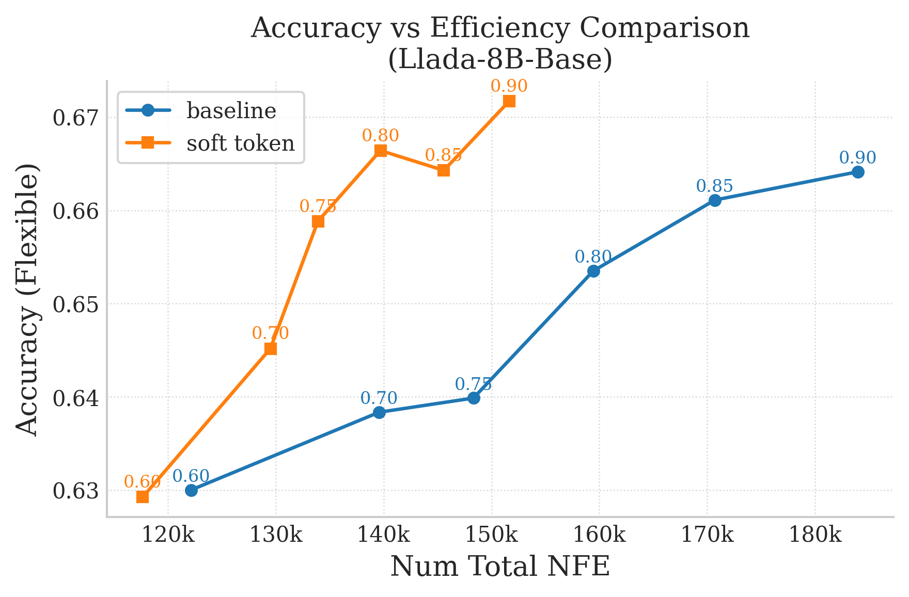

# Soft Token Interpolation for Masked dLLM (LLaDA)

This repository contains a training-free extension to masked diffusion LLMs that interpolates between a hard mask and a decoded token. Instead of collapsing masked positions to a single `[MASK]` embedding, we retain the model's probability distribution from the previous step, mix candidate embeddings, and feed the resulting **Soft Token** back into the next denoising pass. The outcome is a diffusion trajectory that preserves semantic information even when a position remains masked, thus improving information transition flow across diffusion steps.

The codebase originates from the llada part in [Fast-dLLM](https://github.com/NVlabs/Fast-dLLM) implementation, and the idea of mixing candidate embeddings is inspired by the latent reasoning method proposed in [Soft Think](https://arxiv.org/abs/2505.15778).

---

## Table of Contents

1. [Conceptual Overview](#conceptual-overview)
2. [Soft Token Sampling Pipeline](#soft-token-sampling-pipeline)
3. [Running the Provided Experiments](#running-the-provided-experiments)
4. [Plotting and Reporting](#plotting-and-reporting)
5. [Soft Token Parameters](#soft-token-parameters)
6. [Other Directions](#other-directions)

---

## Conceptual Overview

- **Problem.** In masked diffusion decoding, only unmasked positions contribute signal during a denoising step. Specifically, early steps therefore operate on a sea of `[MASK]` embeddings, discarding useful information gathered in previous iterations.
- **Idea.** Keep a continuous latent between "mask" and "token". When a position remains masked, store the predicted token distribution from the previous step and form a soft embedding by mixing candidate token embeddings (  ).
- **Benefits.**
  - Information from previous steps flows through the model even if the discrete token has not been committed.
  - Sampling is more efficient, because fewer steps are wasted rediscovering what was already inferred.
  - This approach requires no retraining and introduces only minimal computational overhead.

---


## Soft Token Sampling Pipeline

### 1. Candidate Selection (`generate.py`)

1. Decode with the base samplers until logits for the current block are available.
2. Call `get_transfer_index_soft_token` to:
   - Decide which masked positions transition this step.
   - Record the top-`k` (default `k=5`) token ids with probabilities for **all** positions.
   - Append a synthetic `[MASK]` candidate with probability `1 − p_max + bias` (`bias` defaults to `0.5`).
3. Update with the committed tokens and cache the `(soft_token, prob)` tensors.

References: `generate_with_dual_cache_soft_token` and `get_transfer_index_soft_token` in `generate.py`.

### 2. Soft Embedding Injection (`model/modeling_llada.py`)

Modify the model forward to accept two optional tensors: `soft_token` (top-`k` ids per position) and `prob` (their weights). When supplied:

1. Retrieve the base token embeddings  for all candidate tokens (via `F.embedding`), and their probabilities are renormalized.
2. Compute the weighted mixture to form the soft embedding
   , producing .
3. For positions that remain `[MASK]`, replace their embeddings with ; decoded (unmasked) positions retain their original embeddings.

References: `LLaDAModelLM.forward` in `model/modeling_llada.py`.

---

## Running the Provided Experiments

1. **Choose a checkpoint.**  
   - Base: `GSAI-ML/LLaDA-8B-Base`  
   - Instruct: `GSAI-ML/LLaDA-8B-Instruct`
2. **Set the environment.**
   ```bash
   export HF_ALLOW_CODE_EVAL=1
   export HF_DATASETS_TRUST_REMOTE_CODE=true
   ```
3. **Launch a sweep.**
   ```bash
   cd test/Soft-token-llada
   bash eval_dual_soft_token_base.sh   # or eval_dual_soft_token_inst.sh
   ```
   The script will:
   - Detect the available GPUs and pass them to `accelerate launch`.
   - Loop over `task_list=(mbpp gsm8k)` and a list of confidence thresholds.
   - For each combination, run both the soft-token variant (outputs under `eval_results_soft_token/...`) and the baseline dual-cache decoder (outputs under `eval_results/...`).
4. **Inspect outputs.**
   - `results_{timestamp}.json` contains the `lm-eval-harness` metrics.
   - `summary.txt` logs tokens/sec and total NFEs.

---

## Plotting and Reporting

- Use `plotting/extract.py` to aggregate gsm8k runs into a single JSON file keyed by threshold. It reads both accuracy metrics and the `summary.txt` NFEs:
  ```bash
  python plotting/extract.py eval_results_soft_token/base_parallel_dual xxx.json --task gsm8k --method-key soft-token
  ```
- Use `plotting/plot_gsm8k.py` to create comparison figures. Update the paths/method keys before running.

- **Example results.** Soft tokens consistently outperform the baseline on the accuracy–latency frontier for GSM8K using both LLaDA-8B-Instruct and LLaDA-8B-Base with different confidence threshold.

  

---

## Soft Token Parameters

- **Vary `k_soft`.** Adjust the number of candidate tokens `k_soft` in `get_transfer_index_soft_token` for expressiveness.
- **Vary `addition_prob_mask`.** Change mask probability `bias` in `get_transfer_index_soft_token` to set how aggressively the model can revert to `[MASK]`.

---

## Other Directions

These functions are currently exploring directions other than the soft-token method.

- 1. Function `generate_*_dual_branch`: keeps dual branches (spec and main) with frequent merging in diffusion steps.
- 2. Function `generate_with_dual_branch_embedding`: merge the dual branches with a indicator of the model layer embedding similarity.
- 3. Function `generate_with_dual_cache_evlove_block`: applies block decoding but using an adaptive evolve block.
